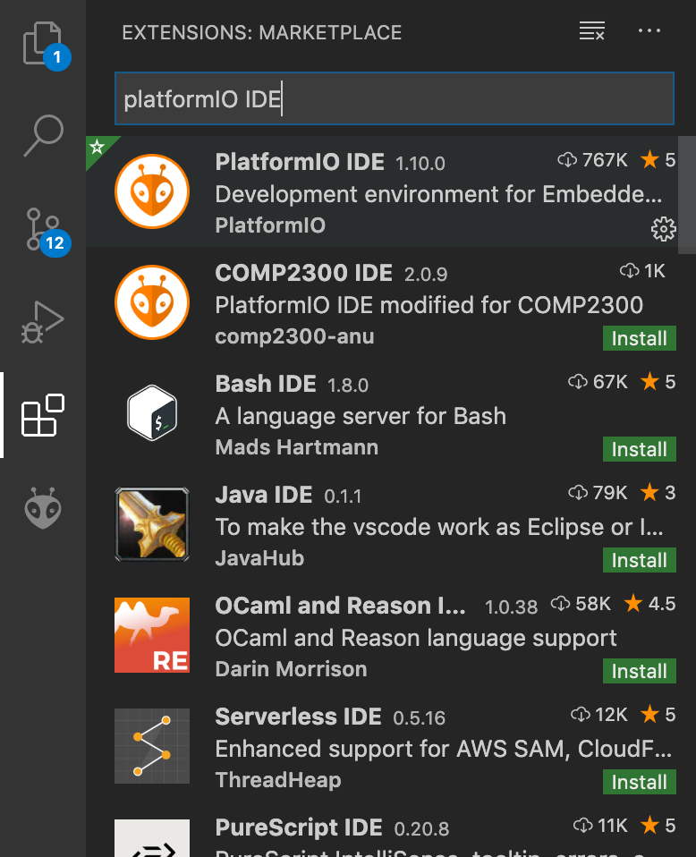
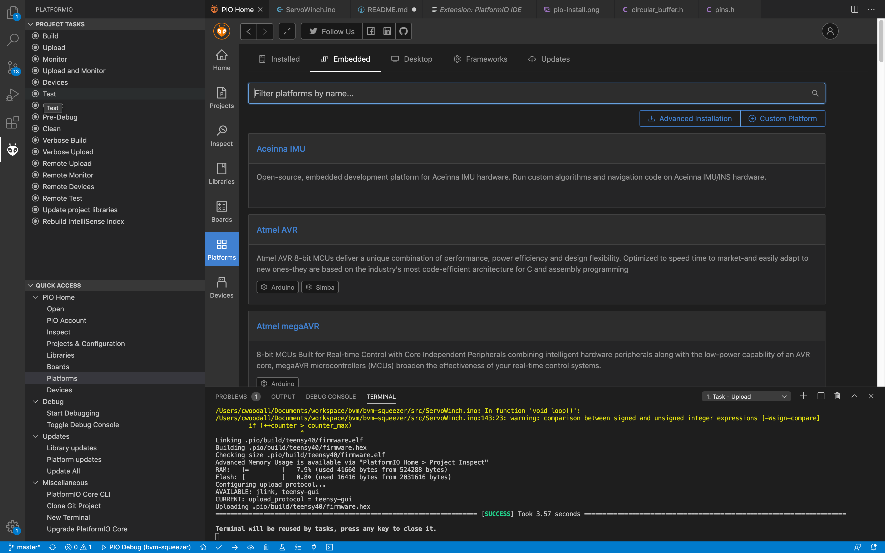

# BVM Squeezer Software

Software for the BVM Squeezer (COVID-19 Response)

## Setup Instructions

This project used a Teensy4.0 and for development environment uses the Arduino Framework and the PlatformIO development environment.

To set this up:

1. Download and install [Arduino](arduino.cc) on your machine
2. Download and install the [Teensyduino](https://www.pjrc.com/teensy/td_download.html) software support (Required for Windows for the serial monitor, Optional for Mac)
2. Download and install [Visual Studio Code](https://code.visualstudio.com) (Available on Mac, Windows and Linux)
3. Open `Visual Studio Code` click on the extensions (or type `Ctrl-Shift-P` (`Command-Shift-P` on os X) to bring up the VS Code command prompt and type `Extensions: Install Extensions`)

4. Restart VSCode
5. A little alien bug face will have appeared at the bottom of the side bar. Press this.
6. In the `> Quick Access` panel
 select Platform, select Embedded and search for `Teensy` install this.
7. Download the git project

```
git clone git@github.com:Beta-Technologies/bvm-squeezer.git
```

8. Open the project folder in VSCode

## Building, Flashing and Monitoring.

3 major actions you should be able to do: Build, Upload and Serial Monitor. All of these actions are available through the PlatformIO side bar (press on the little alien thign and see the `Project Tasks` section). Or through the `Ctrl + Shift + P` (`CMD + SHIFT + P` on OSX) menu just type Upload, Build or Monitor and select the appropriate PlatformIO action.

## Calibration

For now calibration mode is activated at compile time.

Go to the `Mode mode` variable and set the mode to `Mode::CALIBRATION`

Now the potentiometer sends pulses from `1000us` to `2000us` over the serial monitor this will list out the pulsewidth that is currently being set. To calibrate:

1. turn the potentiometer to find your open, closed and idle positions. 
2. Set the open and close position in the `WinchSettings settings` struct. These values are currently in microseconds.

For example:

```c++
WinchSettings settings = {
    .closed_us = 1559,
    .open_us = 1790,
    .idle_us = 1400
};
```

## Running in "Rate Mode"

Set the `Mode mode = Mode::SERVO` this will run rate control. In the far position to one side the motor will go to the idle position and not move (OFF). As you turn the dial it will increase its control rate.